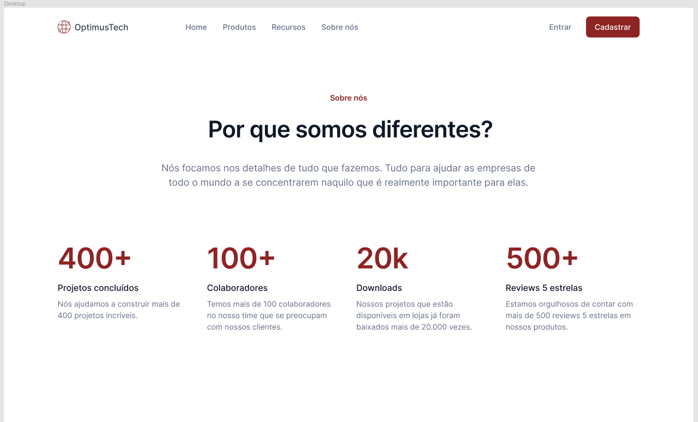

# website criado com HTML e CSS

Projeto do #7daysofCode

| :placard: Vitrine.Dev | https://cursos.alura.com.br/vitrinedev/igorpel13 |
| -------------  | --- |
| :sparkles: Nome        | **Website criado com HTML/CSS**
| :label: Tecnologias | HTML/CSS
| :rocket: URL         | https://projetovagas.vercel.app/

<!-- Inserir imagem com a #vitrinedev ao final do link -->
#vitrinedev

## Detalhes do projeto
Projeto feito após os estudos da aula no curso Iniciante em programação.
